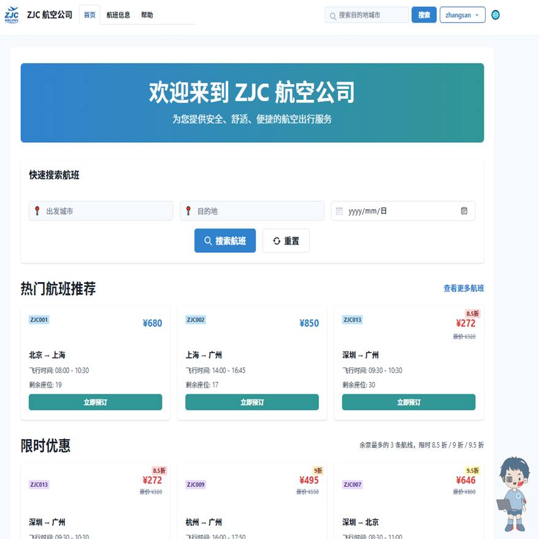
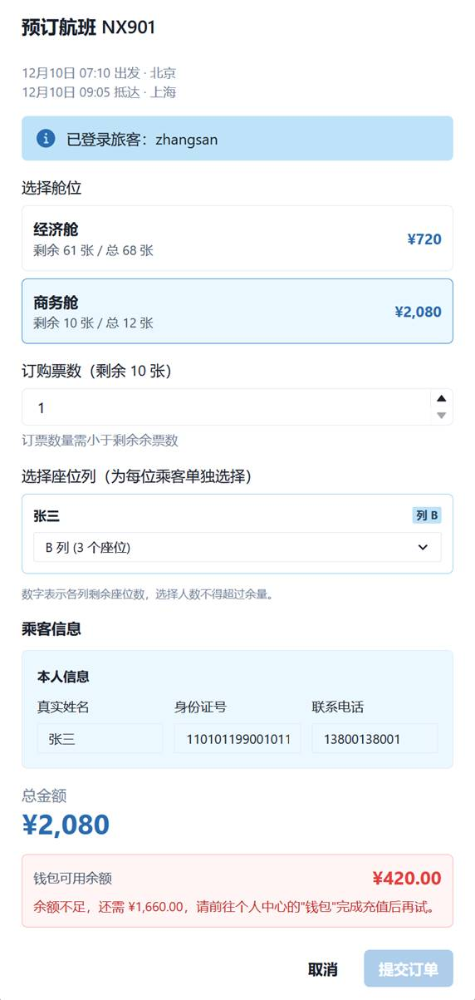
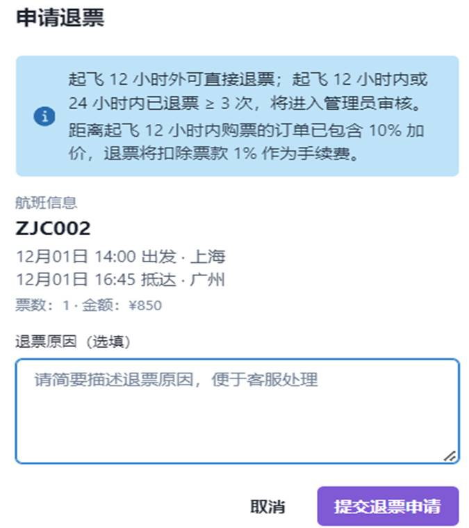
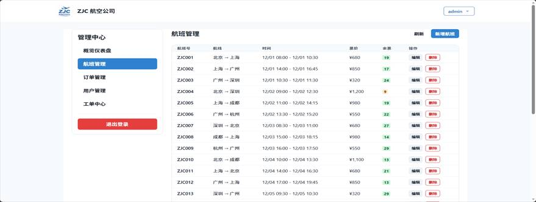
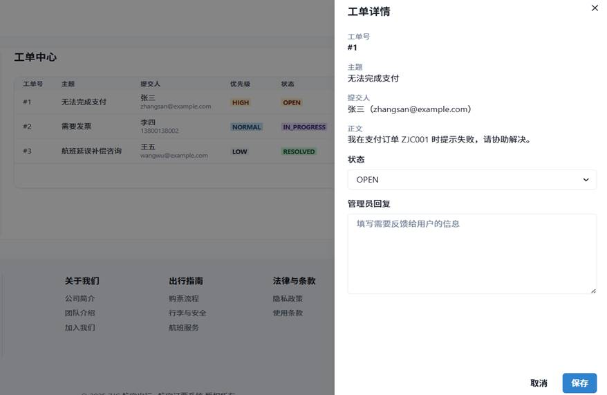

# ZJC 航空公司机票预订系统

ZJC 航空公司机票预订系统是一个前后端分离的航空票务管理平台。系统围绕机票预订业务展开，覆盖用户注册登录、航班查询、在线订票、座位选择、订单支付、退票改签、工单反馈、管理员后台和 AI 客服等流程。

项目中的业务数据均为模拟数据，主要用于功能演示、本地开发测试和课程实验场景。

## 项目概览

系统分为用户端和管理员端。用户端面向旅客，提供航班检索、订票、订单管理、钱包充值、退票改签、工单提交和在线客服能力。管理员端面向运营人员，提供航班、用户、订单、工单和基础统计数据的管理入口。

后端采用 Spring Boot 构建 REST API，使用 Spring Data JPA 访问 MySQL 数据库。前端采用 Next.js App Router 和 Chakra UI 构建页面，通过 Axios 与后端接口通信。AI 客服功能由前端会话组件发起请求，后端代理调用 DeepSeek API，避免在前端暴露 API Key。

## 界面截图

### 首页与航班检索



### 订票与支付确认



### 退票申请



### 管理员航班管理



### 工单中心



## 主要功能

### 用户端

- 用户注册、登录、资料查看和资料编辑。
- 航班查询，支持按出发地、目的地、日期等条件筛选。
- 航班列表展示，包含航班号、路线、起降时间、票价、余票和航班状态。
- 在线订票，支持多乘客信息填写和座位列选择。
- 钱包余额展示、模拟充值和订单支付。
- 我的订票单，支持查看订单详情、支付待支付订单、取消订单、退票和改签。
- 我的工单，支持查看用户提交的反馈与管理员回复。
- 在线客服入口，支持 AI 客服问答和航班、订单相关问题咨询。

### 管理员端

- 仪表盘统计，展示用户、订单、航班、工单等基础数据。
- 航班管理，支持新增、编辑、删除航班，维护机型、路线、起降时间、票价、舱位和余票。
- 订单管理，支持查看订单列表、筛选订单状态、查看订单详情和处理退票申请。
- 用户管理，支持查看用户列表、启用或禁用用户、查看用户状态和钱包信息。
- 工单管理，支持查看工单、按状态筛选、回复用户和更新处理状态。
- 数据可视化，使用图表展示订单状态、趋势和统计信息。

### AI 客服

- 前端提供悬浮客服入口和客服会话页面。
- 后端通过 `/api/ai/chat` 统一代理 AI 请求。
- 支持将用户问题转发给 DeepSeek Chat 模型。
- 未配置 `DEEPSEEK_API_KEY` 时，后端会返回明确的未配置提示。
- AI Key 仅由后端环境变量读取，不写入公开仓库。

## 业务流程

### 订票流程

用户登录后进入航班页面，选择出发地、目的地和日期进行检索。系统返回符合条件的航班列表，并展示余票、票价和起降信息。用户选择航班后填写乘客信息和座位偏好，确认订单后进入支付或待支付状态。

### 支付与钱包

系统使用钱包余额模拟真实支付流程。用户可以在个人中心进行模拟充值，订单支付时从钱包余额中扣减对应金额。该流程用于演示订单支付、余额校验和订单状态变更，不接入真实支付渠道。

### 退票与改签

已支付订单可以发起退票或改签。退票流程会根据订单状态进入申请或审核逻辑，管理员可以在后台处理退票请求。改签流程会加载原订单信息，选择新航班后计算新旧订单差价与手续费，并更新订单记录。

### 工单反馈

用户可以在联系页面提交问题反馈，填写主题、内容、联系方式和问题类型。管理员在后台查看工单并回复，用户可以在自己的工单页面查看处理结果。

## 技术栈

### 后端

- Java 17
- Spring Boot 3.3.0
- Spring Web
- Spring Data JPA
- Spring Security
- MySQL
- Maven

### 前端

- Next.js 14
- React 18
- TypeScript
- Chakra UI
- Axios
- ECharts / echarts-for-react
- Redux Toolkit
- Framer Motion
- Day.js

### 文档与接口

- OpenAPI 文档
- Postman / Apifox 接口集合
- SQL 初始化脚本与迁移脚本
- Markdown 项目文档

## 系统结构

```text
.
├── src/                          # Spring Boot 后端源码
│   └── main/
│       ├── java/com/example/demo/
│       │   ├── config/           # CORS、安全等配置
│       │   ├── controller/       # REST API 控制器
│       │   ├── service/          # 业务逻辑
│       │   ├── repository/       # JPA Repository
│       │   ├── entity/           # 数据库实体
│       │   ├── dto/              # 请求与响应对象
│       │   └── util/             # 工具类
│       └── resources/
│           └── application.properties
├── zjc-airline-booking-frontend/ # Next.js 前端源码
│   ├── src/app/                  # 页面路由
│   ├── src/components/           # 通用组件
│   ├── src/context/              # 前端上下文
│   └── src/lib/                  # API、认证、业务规则封装
├── database/                     # 数据库脚本
├── api/                          # API 文档和接口测试集合
├── docs/                         # 项目说明文档
├── pom.xml                       # 后端 Maven 配置
└── README.md
```

## 后端模块

### Controller

后端控制器按业务领域划分，主要包括用户、航班、订单、座位、工单和 AI 会话接口。控制器负责接收前端请求、调用 Service 层处理业务，并以统一的 `ApiResponse` 结构返回结果。

### Service

Service 层承载主要业务逻辑，例如航班查询、订单创建、座位分配、退票改签、钱包余额更新、用户状态管理、工单处理和 AI 请求代理。

### Repository

Repository 层基于 Spring Data JPA 封装数据库访问逻辑，包含航班、订单、用户、座位、工单等实体的数据查询和更新。

## 数据模型

项目中主要包含以下业务实体。

- `User`：用户信息、角色、状态、钱包余额等。
- `Flight`：航班号、机型、出发地、目的地、起降时间、备注等。
- `FlightSeat`：旧版舱位维度座位与价格信息。
- `Seat`：新版单座位明细，包含座位号、舱位、可用状态和加价信息。
- `Booking`：订单信息、订单号、状态、总金额、退票改签字段等。
- `BookingSeat`：订单与实际座位之间的映射关系。
- `SupportTicket`：用户提交的工单、优先级、状态和管理员回复。

数据库脚本位于 `database/` 目录，包含初始化结构、演示数据和功能迭代过程中的迁移脚本。

## API 文档

接口文档和测试集合位于 `api/` 目录。

- `api/API_DOCUMENTATION.md`：接口说明文档。
- `api/API_ENDPOINTS.md`：接口路径整理。
- `api/openapi.yaml`：OpenAPI 描述文件。
- `api/ZJC_Airline_Booking_API.postman_collection.json`：Postman 测试集合。
- `api/APIFOX_GUIDE.md`：Apifox 使用说明。

## 本地运行

### 环境要求

- Java 17
- Maven
- Node.js
- MySQL

### 初始化数据库

先创建数据库。

```sql
CREATE DATABASE zjc_airline_booking_db
  DEFAULT CHARACTER SET utf8mb4
  DEFAULT COLLATE utf8mb4_unicode_ci;
```

再根据需要导入 `database/schema.sql`、`database/data.sql` 或 `database/zjc_airline_booking_db.sql`。

### 启动后端

在项目根目录运行：

```bash
./mvnw spring-boot:run
```

Windows 环境可使用：

```bash
mvnw.cmd spring-boot:run
```

后端默认运行在 `http://localhost:8080`。

### 启动前端

进入前端目录：

```bash
cd zjc-airline-booking-frontend
npm install
npm run dev
```

前端默认运行在 `http://localhost:3000`。

## 环境变量

后端配置支持通过环境变量覆盖数据库和 DeepSeek API 信息。

```bash
DB_URL=jdbc:mysql://localhost:3306/zjc_airline_booking_db?useSSL=false&serverTimezone=Asia/Shanghai&useUnicode=true&characterEncoding=utf-8
DB_USERNAME=root
DB_PASSWORD=your_database_password
DEEPSEEK_API_BASE_URL=https://api.deepseek.com/v1
DEEPSEEK_API_KEY=your_deepseek_api_key
```

前端可在 `zjc-airline-booking-frontend/.env.local` 中配置后端地址。

```bash
NEXT_PUBLIC_API_BASE_URL=http://localhost:8080
```

仓库中提供 `.env.example` 和 `zjc-airline-booking-frontend/.env.local.example` 作为配置示例，不提交真实 API Key。

## 安全说明

- DeepSeek API Key 由后端环境变量读取，前端不直接保存密钥。
- 公开仓库中的数据为模拟数据。
- 当前项目保留了演示用的 mock token 和模拟支付流程，不应直接作为生产系统使用。
- 如需部署到公网，应补充真实认证鉴权、接口权限控制、支付安全、日志审计和生产级密钥管理。

## 项目文档

`docs/` 目录中包含系统架构、功能实现、数据库设计、业务逻辑、安全说明、性能优化等文档。它们可以帮助理解项目的设计过程和主要实现思路。

## 说明

这是一个演示性质的订票系统项目，适合用于本地运行、接口测试和完整业务流程查看。
